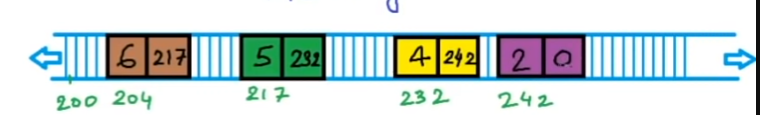

# LinkedList


In linkedlist we store the data in two parts, one part containing the value of the data and the other part containing address of the next element of the list.



```cpp
struct Node{
    int data; //4 bytes
    Node* next; //4 bytes
}
```

The first node is called the head node. The only information we keep for the list is the address of the head node. Address of the head node gives us access of the complete list. Address of the last node is null/0.

## Time Complexity

-   Access to elements
    -   Proportional to number of element(n).
    -   O(n)
-   Insert/ Delete
    -   O(n)

## Array vs LinkedList

| Parameters                   | Array                                                    | LinkedList                                            |
| ---------------------------- | -------------------------------------------------------- | ----------------------------------------------------- |
| Cost of accesing an element  | Constant Time. O(1)                                      | Proportional to number of elements. O(n)              |
| Memory requirements          | Fixed Size                                               | No unusedd memory. Extra memory for pointer variables |
|                              | Sometime memory may not be available as one larger block | Memory may be available as multiple small blocks      |
| Cost of inserting an element |
| a. At the beginning          | O(n)                                                     | O(1)                                                  |
| b. At the end                | O(1) if array is not full, else O(n)                     | O(n)                                                  |
| c. At ith position           | O(n)                                                     | O(n)                                                  |
| Ease of use                  | Easy                                                     | Not easy                                              |
